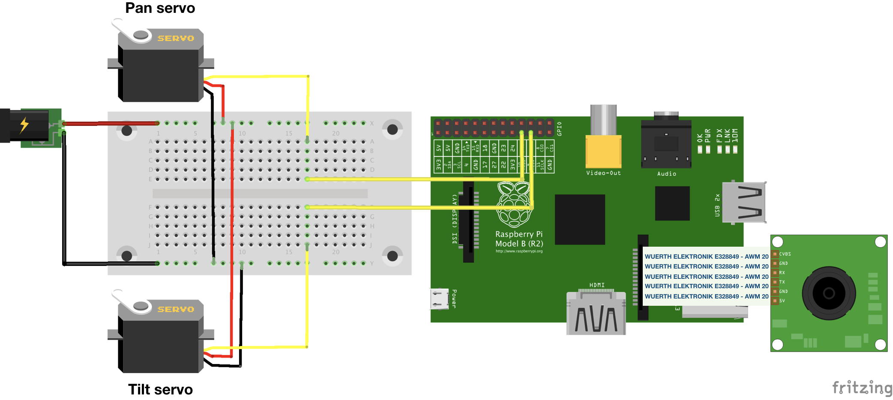

RPI Pan-tilt Cam
===========================

Provides the software and provisioning recipes to get in a few minutes all the necessary software and configuration for 
a Raspberry PI camera in a pan-tilt support.

## Features

- Configures your network to connect your RPI via Wifi (if you need it).
- Enables and configures your RPI cam.
- Emits video by UDP and WebRTC (no additional plugins in browser).
- Provides a basic web interface to handle pan-tilt support via websockets (you'll move your camera remotely) and watch 
real time video.

## Hardware requirements

- Raspberry PI (Library code has been tested with RPI B+).
- SD Card.
- Pan tilt support handled by 2 servos (5v power input).
- MPEG camera for Raspberry PI.
- WiPi wifi USB module (optional).
- SD Card reader (optional. Its needed to burn OS only if you don't have it yet).
- Keyboard, display and HDMI wire (optional. Only if you don't have SSH configured or you need to burn OS).

## Setting up the camera and pan-tilt support

Here is an easy approach to connect all the components by using a breadboard. Obviously you can use any other approach. 
Anyway, you have to keep in mind that a 5V external power input is mandatory; RPI's 5V pins doesn't have enouth amperage.



## Installation

### Burning Raspbian

If you have Raspbian already installed in SD card, you can omit this step.

Follow the [installation guide](https://www.raspberrypi.org/documentation/installation/installing-images/).

### Enhable SSH

Ignore this step if you have SSH configured in your RPI.

Follow the [SSH guide](https://www.raspberrypi.org/documentation/remote-access/ssh/README.md#3-enable-ssh-on-a-headless-raspberry-pi-add-file-to-sd-card-on-another-machine)

#### Optional SSH profile and key configuration in your local machine

To grant RPI access to your local machine by SSH key (to avoid user-pwd login), first of all you need to generate a RSA key pair; you can do it by command:

```
ssh-keygen -t rsa #This will ask you about your new identity name
```

Copy generated SSH identity to RPI

```
# Replace vars (__x__) with your config values
ssh-copy-id -i __rsaFile__ __user__@__host__
# For example
ssh-copy-id -i ~/.ssh/id_rsa pi@192.168.1.3
```

Now, you can configure a custom connection to use this identity with your RPI; add this snippet to the end of ~/.ssh/config file (it is filled with example values; you must replace it with yours):

```
Host rpi
    HostName 192.168.1.3
    Port 22
    User pi
    IdentityFile /Users/jvcalderon/.ssh/rpi1_rsa
    IdentitiesOnly yes
```

## Run Ansible's playbooks

### Inventory

You have to create the Ansible's inventory file. If you have used a custom SSH host you can just use inventory.dist file as follows:

```
cp ./inventory.dist inventory # from project root
```

Otherwise you can read [inventory intro](https://docs.ansible.com/ansible/latest/user_guide/intro_inventory.html) to set a custom configuration.

### Network configuration

Copy network params dist file and use it as template:

```
cp ./playbooks/network/params.yml.dist ./playbooks/network/params.yml # from project root
```

Open the new file and replace with your WIFI network values. For example:

```
wlan:
  address: "192.168.1.3"
  gateway: "192.168.1.1"
  passphrase: "__PASSPHRASE__"
  ssid: "__SSID__"
```

### Launch installation

Now you just need to run the installation (Ansible is required in your local machine. You can read the [installation guide](https://docs.ansible.com/ansible/latest/installation_guide/intro_installation.html))

```
# From project root:

ansible all -i ./inventory -m ping # Check RPI availability
ansible all -i ./inventory -a "/bin/echo hello" # Run test command

# If everething is OK then run:

ansible-playbook -i ./inventory mainPlaybook.yml
```
